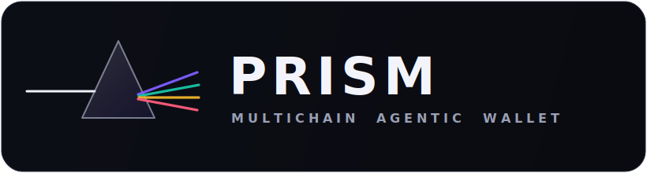
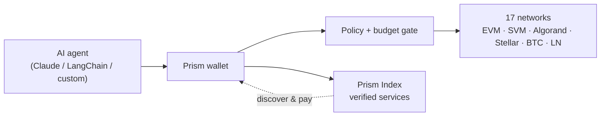

<div align="center">



### A self-custodial **multichain agentic wallet** — give any AI agent keys, balances, and the power to discover, authorize, and settle payments across every chain.

[](#-supported-chains)
[](#-install-in-claude-desktop-30-seconds)
[](#-x402-payments)
[](./LICENSE)

**[⬇️ Download for Claude Desktop](https://github.com/ogsamrat/multichain-agentic-wallet/releases/latest/download/prism.mcpb)** · **[🔎 Live registry & explorer](https://prism-index.vercel.app)** · **[📦 Releases](https://github.com/ogsamrat/multichain-agentic-wallet/releases)**

</div>

---

AI agents can reason, plan, and execute. **Prism lets them pay** — autonomously, across chains, without leaking keys or blowing a budget. It's a wallet engine, an MCP server, a CLI, an SDK, and a verified service registry, all in one monorepo.



## 🚀 Install in Claude Desktop (30 seconds)

No terminal. No config files. No API keys.

1. **[Download `prism.mcpb`](https://github.com/ogsamrat/multichain-agentic-wallet/releases/latest/download/prism.mcpb)** from the latest release.
2. **Double-click it** (or drag it into Claude Desktop → **Settings → Extensions**).
3. Paste a recovery phrase (or per-chain keys), set your **per-call / per-day caps**, and you're done.

Your keys are encrypted on your machine (`~/.prism`) and never leave it. Then just ask Claude:

> _"What's my USDC balance on Base?"_ · _"Pay this x402 endpoint and summarize the result."_ · _"Find a cheap transcription API I can pay in USDC and call it."_

## ✨ Why Prism

|                                   |                                                                                                                                                                                                                              |
| --------------------------------- | ---------------------------------------------------------------------------------------------------------------------------------------------------------------------------------------------------------------------------- |
| 🌐 **Truly multichain**           | One recovery phrase derives keys for **EVM, Solana, Algorand, Stellar, Bitcoin, and Lightning**. Account-model and UTXO/LN rails share one capability-flagged `ChainAdapter` — adding a chain is one module.                 |
| 🔐 **Self-custodial**             | Keys live in an encrypted keystore (scrypt + XChaCha20-Poly1305). Adapters only ever receive a single derived secret for one authorized action — never the master seed.                                                      |
| 🛡️ **Policy-gated autonomy**      | Every value-moving action passes one chokepoint: per-call / per-day caps, per-chain limits, allow/deny lists, and three autonomy modes (`full_autonomous`, `session`, `human_in_the_loop`). Budgets persist across restarts. |
| 💸 **x402, negotiated**           | `x402_fetch` performs the HTTP 402 handshake, picks the **cheapest (or fastest)** option the wallet can fund across all chains, signs, retries, and records a receipt.                                                       |
| 🔎 **Discovery that doesn't rot** | The **Prism Index** only lists services that pass a real protocol handshake — and auto-delists them the moment they break.                                                                                                   |

## 🔗 Supported chains

| Family        | Networks                                                                    | Highlights                                        |
| ------------- | --------------------------------------------------------------------------- | ------------------------------------------------- |
| **EVM**       | Base, Ethereum, Arbitrum, Optimism, Polygon, Avalanche (+ Base/Eth Sepolia) | USDC via EIP-3009 (gasless x402), ENS, allowances |
| **Solana**    | Mainnet, Devnet                                                             | SOL + SPL/USDC transfers                          |
| **Algorand**  | Mainnet, Testnet                                                            | ALGO + ASA/USDC, x402 (AVM), ASA opt-in           |
| **Stellar**   | Pubnet, Testnet                                                             | XLM + USDC, trustlines, x402                      |
| **Bitcoin**   | Mainnet, Testnet                                                            | P2WPKH transfers, BIP-21                          |
| **Lightning** | bolt11                                                                      | invoices + pay (pluggable LN backend)             |

## 🧰 Agent tools

The MCP server, CLI, and SDK all expose the same operations:

- **Wallet** · `list_chains` · `get_address` · `init_wallet` · `unlock_wallet` · `lock_wallet`
- **Portfolio** · `get_balances` · `get_portfolio` · `get_token_info`
- **Send/receive** · `send` · `request_funding` · `resolve_name`
- **x402** · `pay` · `x402_fetch` · `list_receipts`
- **Lightning** · `create_invoice` · `pay_invoice`
- **Allowances** · `get_allowance` · `set_allowance`
- **Discovery** · `discover_services` · `get_service`
- **Policy** · `get_policy` · `set_policy` · `get_spending_report` · `confirm_action`
- **Utility** · `simulate` · `sign_message` · `get_tx_status`

## 🛠️ Use it your way

<details open>
<summary><b>CLI</b></summary>

```bash
export PRISM_SEED="your twelve word recovery phrase ..."
node apps/cli/dist/index.js chains
node apps/cli/dist/index.js balance base
node apps/cli/dist/index.js fetch https://api.example.com/paid --max-usd 0.05
node apps/cli/dist/index.js discover "speech to text" --asset USDC --max-usd 0.02
```

</details>

<details>
<summary><b>SDK</b></summary>

```ts
import { createWallet } from '@prism/sdk'

const wallet = createWallet()
const portfolio = await wallet.getPortfolio()
const res = await wallet.x402Fetch('https://api.example.com/paid', {
  prefer: 'cheapest'
})
const found = await wallet.discoverServices({
  q: 'image generation',
  asset: 'USDC'
})
```

</details>

<details>
<summary><b>MCP config (JSON)</b></summary>

```jsonc
{
  "mcpServers": {
    "prism": {
      "command": "node",
      "args": ["<repo>/packages/mcp-server/dist/index.js"],
      "env": {
        "PRISM_SEED": "your twelve word recovery phrase ...",
        "PRISM_NETWORK": "base",
        "PRISM_MAX_PER_CALL": "0.10",
        "PRISM_MAX_PER_DAY": "20.00"
      }
    }
  }
}
```

</details>

## 🔎 The Prism Index — a registry that's _verified or it's not listed_

**Live: [prism-index.vercel.app](https://prism-index.vercel.app)**

- Every x402 listing is verified by performing the **real HTTP 402 handshake** — never a self-declaration — then re-checked on a schedule and **auto-delisted** when it breaks.
- Indexes **more than APIs**: MCP servers, model endpoints, datasets, RPC infra, and more.
- Discovery is **multichain and economic**: filter by accepted chain, asset, price ceiling, uptime, and reliability score; results carry ready-to-run `callHint`s.
- **Anyone can list** via the explorer's "List your service" form or `POST /v1/listings` — junk is rejected up front; durable on Postgres.

One project on Vercel serves the frontend and three backends:

| Path         | Service                                           |
| ------------ | ------------------------------------------------- |
| `/`          | Explorer UI                                       |
| `/v1/*`      | Registry API (search, listings, submit, feedback) |
| `/relayer/*` | Optional treasury relayer                         |
| `/seller/*`  | Live x402 example seller (`402` until paid)       |

## 🗺️ Roadmap

**✅ Shipped (v0.1)**

- Multichain wallet: 17 networks across 6 families behind one adapter interface
- MCP server (`.mcpb` one-click install), CLI, and TypeScript SDK over one engine
- x402 payment engine with multi-network negotiation + receipts
- Encrypted keystore, spending-policy/autonomy engine, durable ledger
- Prism Index registry — verified, auto-delisting, self-serve submissions — **live**
- Optional treasury relayer + example x402 seller; polyglot example clients

**🔜 Next**

- Hardened mainnet x402 settlement + a receipts view
- Session keys & on-chain spending policies (ERC-4337 / EIP-7702)
- Solana x402 scheme once standardized
- More chains via the adapter interface (TON, Sui, Aptos, Cosmos/IBC)
- Registry: ownership proofs bound to `payTo`, sybil-weighted reputation, semantic (vector) search
- Fiat on-ramp in the relayer

**🌅 Later**

- Cross-chain routing/bridging abstracted entirely from the agent
- Agent-to-agent and streaming payments
- Multi-sig and hardware-wallet signing
- Native Python / Go SDKs

## 🌍 Polyglot clients

Tiny dependency-free agents that query the Prism Index — see [`clients/`](./clients):

```bash
python clients/python/agent.py "rpc"
cd clients/go && go run . "insight"
ruby clients/ruby/agent.rb "datasets"
```

## ⚙️ Development

```bash
npm install
npm run build        # tsc -b across the workspace
npm test             # vitest
npm run lint         # eslint
npm run verify:naming  # CI gate
npm run build:bundle   # produce prism.mcpb
```

Monorepo: `packages/` (protocol · core · chains · wallet · sdk · mcp-server) · `apps/` (cli · index · relayer) · `examples/paid-api` · `clients/` · `api/` + `public/` (Vercel). Node ≥ 20.11, TypeScript strict + NodeNext throughout.

## 🔒 Security

- Encrypted-at-rest keystore; the master seed never leaves the keyring.
- Every transfer/payment is authorized by the policy engine and written to the durable ledger before any signature.
- Spending caps survive restarts; allow/deny lists and human-in-the-loop gate autonomy.
- The wallet is self-custodial by default; the relayer is opt-in and isolated.

## 📄 License

MIT — see [LICENSE](./LICENSE).
