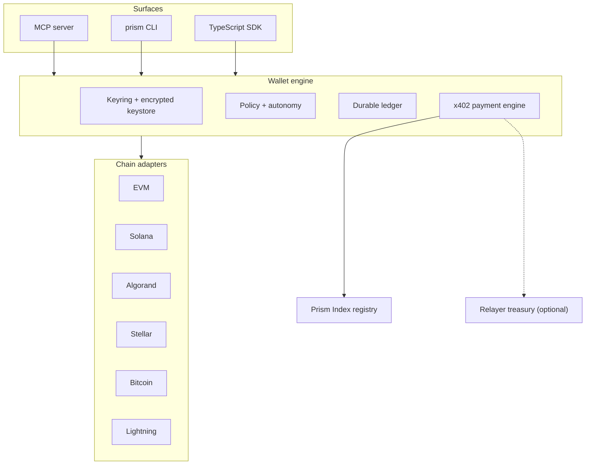

# Prism

> A self-custodial **multichain agentic wallet**. Give any AI agent the ability to hold keys, check balances, and discover, authorize, and settle payments across every chain — under spending policies you control.


**Live:** [prism-index.vercel.app](https://prism-index.vercel.app) — explorer UI, registry API (`/v1/*`), treasury relayer (`/relayer/*`), and a paid x402 endpoint (`/seller/*`).

---

AI agents can reason, plan, and execute. **Prism lets them pay** — autonomously, across chains, without leaking keys or blowing a budget.

Prism is a monorepo containing:

- a **wallet engine** with an encrypted local keystore, a spending-policy/autonomy engine, a durable ledger, and a multi-network x402 payment engine;
- a **pluggable chain-adapter system** that today ships **EVM (8 networks), Solana, Algorand, Stellar, Bitcoin, and Lightning** behind one interface — adding a chain is one module;
- an **MCP server**, a **CLI**, and a **TypeScript SDK** that all share the same wallet brain;
- the **Prism Index** — a registry of agent-payable services where a listing exists only while it _provably works_;
- an optional **relayer** (managed treasury + fiat on-ramp) and an **example x402 seller** for end-to-end testing.

---

## Why Prism

- **Truly multichain.** One recovery phrase derives keys for every chain. Account-model chains (EVM/Solana/Algorand/Stellar) and UTXO/Lightning rails share a single capability-flagged `ChainAdapter`, so the agent always knows what each chain can do.
- **Self-custodial by default.** Keys live in an encrypted keystore under `~/.prism` (scrypt + XChaCha20-Poly1305). Adapters only ever receive the derived secret for one authorized action — never the master seed.
- **Policy-gated autonomy.** Every value-moving action passes one chokepoint: per-call and per-day caps, per-chain limits, allow/deny lists, and three autonomy modes (`full_autonomous`, `session`, `human_in_the_loop`). Budgets are persisted, so they survive restarts.
- **x402, negotiated.** `x402_fetch` performs the HTTP 402 handshake, picks the cheapest (or fastest) option the wallet can actually fund across all chains, signs it, retries, and records a receipt.
- **Discovery that doesn't rot.** The Prism Index only lists services that pass a real protocol handshake and stay verified — broken endpoints are auto-delisted.

---

## Architecture



### Monorepo layout

```
packages/
  protocol/     CAIP-2/CAIP-19 ids, atomic-amount math, x402 types
  core/         typed errors + a stdio-safe logger
  chains/       ChainAdapter + registry + EVM/Solana/Algorand/Stellar/Bitcoin/Lightning
  wallet/       keyring, policy engine, durable ledger, x402 engine, Wallet facade
  sdk/          createWallet() — the programmatic API
  mcp-server/   MCP stdio server + .mcpb manifest
apps/
  cli/          the `prism` command
  index/        the Prism Index registry (Node + edge/cron deployable)
  relayer/      optional managed treasury + on-ramp
examples/
  paid-api/     a minimal x402 seller for end-to-end testing
clients/        polyglot example agents (Python, Go, Ruby) that query the Index
api/            Vercel serverless functions  ·  public/  the explorer frontend
```

---

## Quick start

```bash
npm install
npm run build
```

### As an MCP server (Claude Desktop)

Point your MCP client at the built server:

```jsonc
{
  "mcpServers": {
    "prism": {
      "command": "node",
      "args": ["<repo>/packages/mcp-server/dist/index.js"],
      "env": {
        "PRISM_SEED": "your twelve word recovery phrase ...",
        "PRISM_NETWORK": "base-sepolia",
        "PRISM_MAX_PER_CALL": "0.10",
        "PRISM_MAX_PER_DAY": "20.00",
        "PRISM_INDEX_URL": "http://localhost:8787"
      }
    }
  }
}
```

Or build the one-click desktop bundle: `npm run build:bundle` → `prism.mcpb`.

### As a CLI

```bash
export PRISM_SEED="your twelve word recovery phrase ..."
node apps/cli/dist/index.js chains
node apps/cli/dist/index.js balance base
node apps/cli/dist/index.js fetch https://api.example.com/paid --max-usd 0.05
node apps/cli/dist/index.js discover "speech to text" --asset USDC --max-usd 0.02
```

### As an SDK

```ts
import { createWallet } from '@prism/sdk'

const wallet = createWallet()
const portfolio = await wallet.getPortfolio()
const res = await wallet.x402Fetch('https://api.example.com/paid', {
  prefer: 'cheapest'
})
```

---

## Configuration

Keys may come from an encrypted keystore (`init_wallet` / `prism init`) or from the environment for headless use:

| Variable                                   | Purpose                                              |
| ------------------------------------------ | ---------------------------------------------------- |
| `PRISM_SEED`                               | BIP-39 recovery phrase; derives keys for every chain |
| `PRISM_EVM_PRIVATE_KEY`                    | EVM key override (`0x…`)                             |
| `PRISM_SOLANA_SECRET_KEY`                  | Solana secret (base58) override                      |
| `PRISM_ALGORAND_MNEMONIC`                  | Algorand 25-word override                            |
| `PRISM_STELLAR_SECRET`                     | Stellar `S…` secret override                         |
| `PRISM_BTC_WIF`                            | Bitcoin WIF override                                 |
| `PRISM_LN_CONNECT`                         | Lightning backend, `https://node` + API key          |
| `PRISM_NETWORK`                            | Default chain alias (e.g. `base`)                    |
| `PRISM_MAX_PER_CALL` / `PRISM_MAX_PER_DAY` | Spending caps (USD)                                  |
| `PRISM_AUTONOMY`                           | `full_autonomous` / `session` / `human_in_the_loop`  |
| `PRISM_INDEX_URL`                          | Prism Index base URL for discovery                   |
| `PRISM_RELAYER_URL`                        | Optional relayer base URL                            |

State lives under `~/.prism` (override with `PRISM_HOME`): `keystore.json` (encrypted), `config.json`, `ledger.json`.

---

## Agent tools

Grouped MCP tools (the CLI and SDK expose the same operations):

- **Wallet/identity:** `list_chains`, `get_address`, `init_wallet`, `unlock_wallet`, `lock_wallet`
- **Portfolio:** `get_balances`, `get_portfolio`, `get_token_info`
- **Send/receive:** `send`, `request_funding`, `resolve_name`
- **x402:** `pay`, `x402_fetch`, `list_receipts`
- **Lightning:** `create_invoice`, `pay_invoice`
- **Allowances:** `get_allowance`, `set_allowance`
- **Discovery:** `discover_services`, `get_service`
- **Policy/autonomy:** `get_policy`, `set_policy`, `get_spending_report`, `confirm_action`
- **Simulate/sign/status:** `simulate`, `sign_message`, `get_tx_status`

---

## The Prism Index

A registry that is strictly better than a static directory: **a listing exists only while it provably works.**

- Every `x402` listing is verified by performing the **real HTTP 402 handshake** and validating the payment requirements — never by trusting a self-declaration.
- Listings are **re-checked on a schedule** with a hysteresis state machine and **auto-delisted** when they break; real wallet payments feed liveness back via `POST /v1/feedback`.
- It indexes **more than APIs** — MCP servers, model endpoints, datasets, RPC infra, and more — each with a type-specific probe.
- Discovery is **multichain and economic**: filter by accepted chain, asset, price ceiling, uptime, and reliability score; results carry ready-to-run `callHint`s so an agent can invoke them immediately via `x402_fetch`.

**Listing a service** — anyone can submit through the explorer's "List your service" form or `POST /v1/listings`. The registry runs the real protocol handshake up front and rejects anything that doesn't work, so junk never gets in.

**Durability** — with no database the registry uses an in-memory store (resets on serverless cold start). For permanent listings, set a Postgres connection string as `DATABASE_URL` (or create a Vercel Postgres, which injects `POSTGRES_URL`); it switches to the durable, edge-compatible Neon-backed store automatically — no code change.

Run it locally:

```bash
npm run build -w @prism/index
node apps/index/dist/server.js   # serves on :8787 with seeded demo listings
curl "http://localhost:8787/v1/search?q=insight&asset=USDC"
```

---

## Hosted on Vercel

**Live at [prism-index.vercel.app](https://prism-index.vercel.app).** The repo ships a Vercel deployment (`vercel.json` + serverless functions in `api/` + a static explorer in `public/`). A single project serves the frontend and three backends:

| Path               | Service                                                                                                                        |
| ------------------ | ------------------------------------------------------------------------------------------------------------------------------ |
| `/`                | Prism Index explorer (frontend)                                                                                                |
| `/v1/*`, `/health` | Prism Index registry API                                                                                                       |
| `/relayer/*`       | Optional treasury relayer (`/relayer/health`, `POST /relayer/api/settle`, `/relayer/api/treasury`, `POST /relayer/api/onramp`) |
| `/seller/*`        | Live x402 example seller (`/seller/health`, `POST /seller/api/insight` → 402 until paid)                                       |

Functions run on the Vercel Node runtime via `@hono/node-server`'s `getRequestListener`. The registry uses an in-memory seeded store out of the box; set `DATABASE_URL` for durability. Set `PRISM_TREASURY_EVM_KEY` to enable relayer settlement and `SELLER_PAY_TO` to direct seller payments. An hourly Vercel cron re-verifies listings via `/v1/cron`.

In the Vercel project settings, use Root Directory = repo root and Framework Preset = **Other** so `vercel.json` is honored.

---

## End-to-end demo

```bash
# Terminal A — an x402 seller on Base Sepolia
cp examples/paid-api/.env.example examples/paid-api/.env   # set SELLER_PAY_TO
npm run build -w @prism/example-paid-api && npm run start -w @prism/example-paid-api

# Terminal B — confirm the 402, then let the wallet pay it
curl -i -X POST http://localhost:4021/api/insight -H 'content-type: application/json' -d '{"topic":"defi"}'
PRISM_EVM_PRIVATE_KEY=0x... node apps/cli/dist/index.js fetch http://localhost:4021/api/insight --method POST
```

---

## Development

```bash
npm run build        # tsc -b across the workspace
npm run typecheck    # same, type-only
npm test             # vitest
npm run lint         # eslint
npm run verify:naming  # CI gate: fails on any stray legacy identifier
```

Node ≥ 20.11. TypeScript strict + NodeNext throughout.

---

## Security

- Encrypted-at-rest keystore; the master seed never leaves the keyring.
- Every payment and transfer is authorized by the policy engine and recorded in the durable ledger before any signature.
- Spending caps survive restarts; allow/deny lists and human-in-the-loop confirmation gate autonomy.
- The wallet is self-custodial; the relayer is opt-in and isolated.

## License

MIT — see [LICENSE](./LICENSE).
