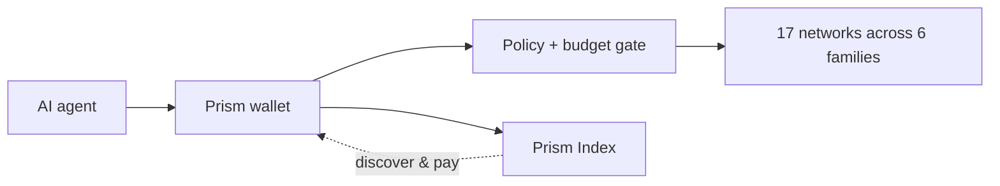

<div align="center">

# Prism

#### A self-custodial multichain agentic wallet — give any AI agent keys, balances, and the power to discover, authorize, and settle payments across every chain.

[Install for Claude Desktop](https://github.com/ogsamrat/multichain-agentic-wallet/releases/latest/download/prism.mcpb) &nbsp;·&nbsp; [Live registry](https://prism-index.vercel.app) &nbsp;·&nbsp; [Releases](https://github.com/ogsamrat/multichain-agentic-wallet/releases)


</div>

---

AI agents can reason, plan, and execute. Prism lets them pay — autonomously, across chains, without leaking keys or blowing a budget. It is a wallet engine, an MCP server, a CLI, an SDK, and a verified service registry, in one monorepo.



## Install in Claude Desktop

No terminal, no config files, no API keys.

1. Download [`prism.mcpb`](https://github.com/ogsamrat/multichain-agentic-wallet/releases/latest/download/prism.mcpb) from the latest release.
2. Double-click it, or drag it into Claude Desktop → Settings → Extensions.
3. Paste a recovery phrase (or per-chain keys), set per-call and per-day caps, done.

Keys are encrypted on your machine (`~/.prism`) and never leave it. Then ask Claude to check a balance, pay an x402 endpoint, or find a service it can pay for.

## Why Prism

|                             |                                                                                                                                                                                                   |
| --------------------------- | ------------------------------------------------------------------------------------------------------------------------------------------------------------------------------------------------- |
| Truly multichain            | One recovery phrase derives keys for EVM, Solana, Algorand, Stellar, Bitcoin, and Lightning. Account-model and UTXO/LN rails share one capability-flagged adapter — adding a chain is one module. |
| Self-custodial              | Keys live in an encrypted keystore (scrypt + XChaCha20-Poly1305). Adapters only ever receive a single derived secret for one authorized action — never the master seed.                           |
| Policy-gated autonomy       | Every value-moving action passes one chokepoint: per-call and per-day caps, per-chain limits, allow/deny lists, and three autonomy modes. Budgets persist across restarts.                        |
| x402, negotiated            | `x402_fetch` performs the HTTP 402 handshake, picks the cheapest or fastest option the wallet can fund across all chains, signs, retries, and records a receipt.                                  |
| Discovery that does not rot | The Prism Index lists only services that pass a real protocol handshake, and delists them the moment they break.                                                                                  |

## Supported chains

| Family    | Networks                                                                    | Highlights                                        |
| --------- | --------------------------------------------------------------------------- | ------------------------------------------------- |
| EVM       | Base, Ethereum, Arbitrum, Optimism, Polygon, Avalanche (+ Base/Eth Sepolia) | USDC via EIP-3009 (gasless x402), ENS, allowances |
| Solana    | Mainnet, Devnet                                                             | SOL and SPL/USDC transfers                        |
| Algorand  | Mainnet, Testnet                                                            | ALGO and ASA/USDC, x402 (AVM), opt-in             |
| Stellar   | Pubnet, Testnet                                                             | XLM and USDC, trustlines, x402                    |
| Bitcoin   | Mainnet, Testnet                                                            | P2WPKH transfers, BIP-21                          |
| Lightning | bolt11                                                                      | invoices and pay (pluggable backend)              |

## Agent tools

The MCP server, CLI, and SDK expose the same operations.

- Wallet — `list_chains`, `get_address`, `init_wallet`, `unlock_wallet`, `lock_wallet`
- Portfolio — `get_balances`, `get_portfolio`, `get_token_info`
- Send and receive — `send`, `request_funding`, `resolve_name`
- x402 — `pay`, `x402_fetch`, `list_receipts`
- Lightning — `create_invoice`, `pay_invoice`
- Allowances — `get_allowance`, `set_allowance`
- Discovery — `discover_services`, `get_service`
- Policy — `get_policy`, `set_policy`, `get_spending_report`, `confirm_action`
- Utility — `simulate`, `sign_message`, `get_tx_status`

## Use it

<details open>
<summary><b>CLI</b></summary>

```bash
export PRISM_SEED="your twelve word recovery phrase ..."
node apps/cli/dist/index.js chains
node apps/cli/dist/index.js balance base
node apps/cli/dist/index.js fetch https://api.example.com/paid --max-usd 0.05
node apps/cli/dist/index.js discover "speech to text" --asset USDC --max-usd 0.02
```

</details>

<details>
<summary><b>SDK</b></summary>

```ts
import { createWallet } from '@prism/sdk'

const wallet = createWallet()
const portfolio = await wallet.getPortfolio()
const res = await wallet.x402Fetch('https://api.example.com/paid', {
  prefer: 'cheapest'
})
```

</details>

## The Prism Index

A registry that is verified or it is not listed. Live at [prism-index.vercel.app](https://prism-index.vercel.app).

- Every x402 listing is verified by performing the real HTTP 402 handshake, re-checked on a schedule, and auto-delisted when it breaks.
- Indexes more than APIs: MCP servers, model endpoints, datasets, RPC infra, and more.
- Discovery is multichain and economic: filter by chain, asset, price ceiling, uptime, and reliability score; results carry ready-to-run call hints.
- Anyone can list through the explorer or `POST /v1/listings`; junk is rejected up front; durable on Postgres.

One project serves the explorer (`/`), the registry API (`/v1/*`), an optional treasury relayer (`/relayer/*`), and a live x402 example seller (`/seller/*`).

## Roadmap

**Shipped (v0.1)**

- Multichain wallet: 17 networks across 6 families behind one adapter interface
- MCP server (one-click `.mcpb` install), CLI, and TypeScript SDK over one engine
- x402 payment engine with multi-network negotiation and receipts
- Encrypted keystore, spending-policy engine, durable ledger
- Prism Index — verified, auto-delisting, self-serve submissions — live
- Optional treasury relayer, example seller, and polyglot example clients

**Next**

- Hardened mainnet x402 settlement and a receipts view
- Session keys and on-chain spending policies (ERC-4337 / EIP-7702)
- Solana x402 once standardized
- More chains via the adapter interface (TON, Sui, Aptos, Cosmos/IBC)
- Registry ownership proofs, sybil-weighted reputation, semantic search
- Fiat on-ramp in the relayer

**Later**

- Cross-chain routing and bridging abstracted from the agent
- Agent-to-agent and streaming payments
- Multi-sig and hardware-wallet signing
- Native Python and Go SDKs

## Development

```bash
npm install
npm run build          # tsc -b across the workspace
npm test               # vitest
npm run lint
npm run verify:naming  # CI gate
npm run build:bundle   # produce prism.mcpb
```

Monorepo: `packages/` (protocol, core, chains, wallet, sdk, mcp-server), `apps/` (cli, index, relayer), `examples/paid-api`, `clients/`, and `api/` + `public/` for the deployment. Node >= 20.11, TypeScript strict throughout.

## Security

- Encrypted-at-rest keystore; the master seed never leaves the keyring.
- Every transfer and payment is authorized by the policy engine and written to the durable ledger before any signature.
- Spending caps survive restarts; allow/deny lists and human-in-the-loop gate autonomy.
- Self-custodial by default; the relayer is opt-in and isolated.

## License

MIT — see [LICENSE](./LICENSE).
